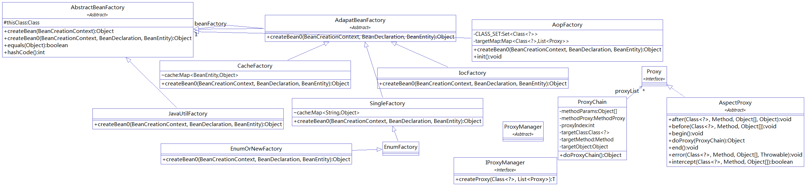

### 之前自己做的aop
- [源码地址](https://gitee.com/wulinghui/java-Web)
- 已经很好了，只不过有好多地方是自己实现的，这里仅仅是更多的利用commons组件。

### 他记
- 本来想用Apache Commons classscan的，但是maven里面没有，也就是该不稳定。 
- 所以需要用个自己的类扫描来，具体实现可以查看 
### 参考资料
- [CGLib动态代理](https://blog.csdn.net/difffate/article/details/70552056)
- [类扫描]([https://blog.csdn.net/baibinboss/article/details/68947929](https://blog.csdn.net/baibinboss/article/details/68947929)
)

### 类图
- 