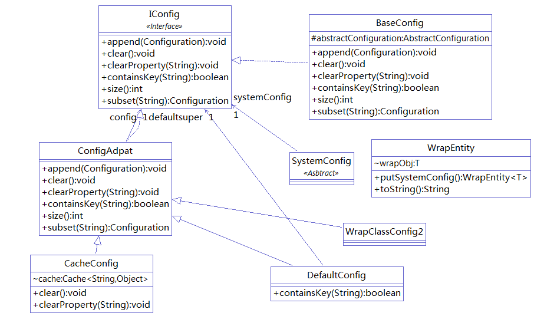

### 整合apache的config
   - 各种配置方式，db,.xml,.yml,.ps
   - 各种增删改查
   - 各种监听，文件变动监听，build监听，使用监听。
### apache的不足
   - 但是对于数据配置的操作是每次都读取，没有使用缓存  
         所以需要整合cache系统，进行适配。   
   - 方法太多，如获得默认值的。
   - 获得默认值的是硬编码，需要改写。
   - 源码有关的配置，没有和有关的框架 @see 
### 依赖
   - log
   - cache
   - confing2
   - wlh-beanUtils
   - wlh-log
   - wlh-exception
### 类图   
   - 采用装饰模式进行增加。
   - 
### Demo
```
	public static void main(String[] args) {
		IConfig iConfig = SystemConfig.get();
		iConfig.addProperty("111", 111);
		System.out.println(iConfig.getString("111"));
	}
	and
	@see com.wlh.config.IConfigTest.testSystemBuilderConfigFactory()
```